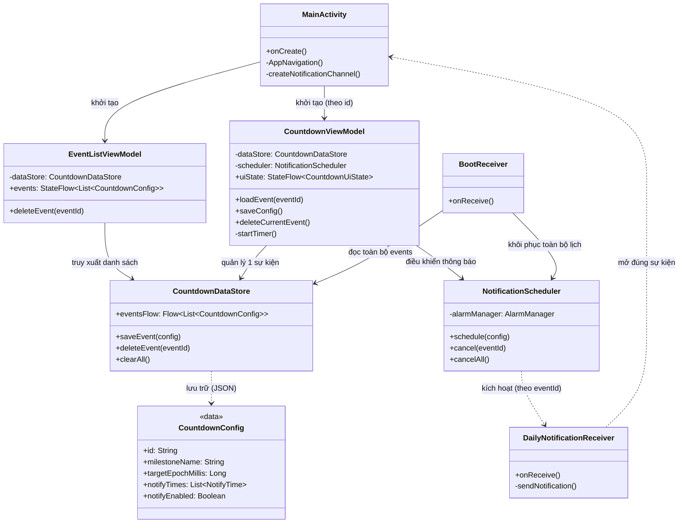

# CountDayLeave - Ứng dụng Đếm ngược Đa sự kiện

**CountDayLeave** là một ứng dụng Android hiện đại giúp bạn theo dõi thời gian còn lại đến NHIỀU mốc thời gian quan trọng trong cuộc sống (ví dụ: ngày ra quân, ngày kết thúc dự án, ngày nghỉ lễ, kỷ niệm, v.v.) với giao diện Premium, hiệu ứng mượt mà và hệ thống thông báo nhắc nhở thông minh.

## 🚀 Tính năng chính

- **Quản lý đa sự kiện**: Theo dõi không giới hạn các mốc thời gian cùng lúc.
- **Màn hình danh sách chuyên nghiệp**: Xem tổng quan tất cả sự kiện với bản xem trước thời gian đếm ngược.
- **Đếm ngược thời gian thực**: Hiển thị chi tiết số ngày, giờ, phút và giây cho từng sự kiện.
- **Thông báo nhắc nhở độc lập**: Thiết lập lịch thông báo riêng biệt cho mỗi sự kiện để không bỏ lỡ tiến độ.
- **Giao diện Premium**: Thiết kế hiện đại với hiệu ứng Glassmorphism, Gradient và Material 3.
- **Hiệu ứng pháo hoa**: Màn hình chúc mừng sinh động khi đếm ngược kết thúc.
- **Lưu trữ tin cậy**: Sử dụng Jetpack DataStore (JSON format) để quản lý danh sách sự kiện bền vững.
- **Tự động khôi phục**: Tự động đặt lại toàn bộ lịch thông báo của các sự kiện sau khi điện thoại khởi động lại.

## 🛠 Công nghệ sử dụng

- **Ngôn ngữ**: [Kotlin](https://kotlinlang.org/)
- **UI Framework**: [Jetpack Compose](https://developer.android.com/jetpack/compose)
- **Kiến trúc**: MVVM (Model-View-ViewModel) + Clean Architecture patterns
- **Lưu trữ**: [Jetpack DataStore](https://developer.android.com/topic/libraries/architecture/datastore) (Preferences + JSON Serialization)
- **Xử lý nền**: AlarmManager & BroadcastReceiver
- **Navigation**: Jetpack Compose Navigation với Type-safe arguments

## 📐 Kiến trúc dự án (Class Diagram)

Dưới đây là sơ đồ cấu trúc các lớp chính và luồng xử lý đa sự kiện:

## 📂 Cấu trúc thư mục

- `model/`: Định nghĩa các thực thể dữ liệu (`CountdownConfig`, `NotifyTime`).
- `data/`: Quản lý lưu trữ danh sách sự kiện dưới dạng JSON string trong DataStore.
- `viewmodel/`: 
    - `EventListViewModel`: Quản lý danh sách toàn cục.
    - `CountdownViewModel`: Xử lý logic cho từng sự kiện cụ thể.
- `ui/`:
  - `screens/`: `EventListScreen`, `SetupScreen`, `CountdownScreen`, `CelebrationScreen`.
  - `components/`: Custom UI (Fireworks, Dialogs, Cards).
  - `theme/`: Design System (Color, Typography, AppTheme).
- `notification/`: Xử lý lập lịch chính xác dựa trên ID sự kiện và nhận tín hiệu hệ thống.

## 📸 Ảnh chụp màn hình

*(Đang cập nhật giao diện đa sự kiện mới)*

## 📄 Giấy phép

Dự án này được phát triển cho mục đích cá nhân và học tập.
