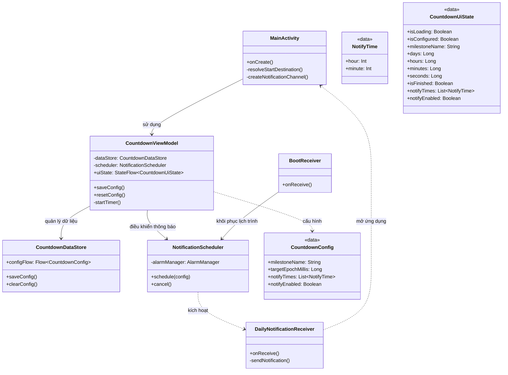

# CountDayLeave - Ứng dụng Đếm ngược Ngày quan trọng

**CountDayLeave** là một ứng dụng Android hiện đại giúp bạn theo dõi thời gian còn lại đến các mốc thời gian quan trọng trong cuộc sống (ví dụ: ngày ra quân, ngày kết thúc dự án, ngày nghỉ lễ, v.v.) với giao diện đẹp mắt và hệ thống thông báo nhắc nhở thông minh.

## 🚀 Tính năng chính

- **Đếm ngược thời gian thực**: Hiển thị chi tiết số ngày, giờ, phút và giây.
- **Thông báo nhắc nhở hằng ngày**: Cho phép thiết lập nhiều khung giờ nhận thông báo trong ngày để không bỏ lỡ tiến độ.
- **Giao diện hiện đại**: Xây dựng hoàn toàn bằng Jetpack Compose với hiệu ứng Gradient và thiết kế Material 3.
- **Hiệu ứng pháo hoa**: Màn hình chúc mừng sinh động với hiệu ứng pháo hoa khi đếm ngược kết thúc.
- **Lưu trữ tin cậy**: Sử dụng Jetpack DataStore để lưu trữ cấu hình và AlarmManager để đảm bảo thông báo luôn đúng giờ.
- **Tự động khôi phục**: Tự động đặt lại lịch thông báo sau khi điện thoại khởi động lại.

## 🛠 Công nghệ sử dụng

- **Ngôn ngữ**: [Kotlin](https://kotlinlang.org/)
- **UI Framework**: [Jetpack Compose](https://developer.android.com/jetpack/compose)
- **Kiến trúc**: MVVM (Model-View-ViewModel)
- **Lưu trữ**: [Jetpack DataStore](https://developer.android.com/topic/libraries/architecture/datastore)
- **Xử lý nền**: AlarmManager & BroadcastReceiver
- **Dependency Injection**: ViewModel & StateFlow

## 📐 Kiến trúc dự án (Class Diagram)

Dưới đây là sơ đồ cấu trúc các lớp chính trong dự án và mối quan hệ giữa chúng:

## 📂 Cấu trúc thư mục

- `model/`: Định nghĩa các thực thể dữ liệu (`CountdownConfig`, `NotifyTime`).
- `data/`: Quản lý lưu trữ bền vững với DataStore.
- `viewmodel/`: Chứa logic nghiệp vụ và quản lý trạng thái UI.
- `ui/`:
  - `screens/`: Các màn hình Setup, Countdown, Celebration.
  - `components/`: Các thành phần UI tùy chỉnh (Fireworks, Dialogs).
  - `theme/`: Định nghĩa phong cách thiết kế của ứng dụng.
- `notification/`: Xử lý lập lịch và đẩy thông báo hệ thống.

## 📸 Ảnh chụp màn hình

*(Đang cập nhật)*

## 📄 Giấy phép

Dự án này được phát triển cho mục đích cá nhân và học tập.
